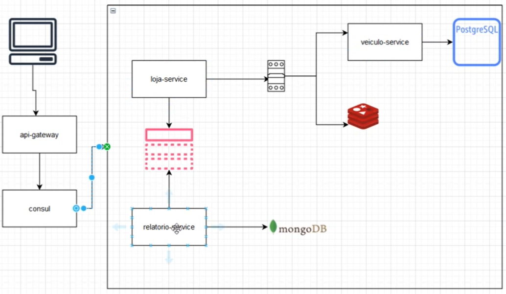

# kotlin_micronaut

A aplicação foi desenvolvida com Kotlin, Java e Micronaut e além das tecnologias Postgres, MongoDB, Service Discovery, API gateway, circuit break e kafka. A aplicação é composta por um microsserviço de loja que é responsavel for realizar a lógica da venda e se comunica com o microsserviço de veiculo para obter os dados do veículo que será vendido, após realizar a venda, os dados dessa venda é publicado num tópico do kafka. Um microsserviço consome os dados do kafka e grava esses dados num banco de dados MongoDB. Todos esses serviços se registram num service discovery, aqui será usado o Consul, e o cliente acessar via API gateway.

## PostgreSql 
1. docker run --name ms-postgres -e "POSTGRES_PASSWORD=123456" -p 5432:5432 -d postgres
2. docker exec -it HASH bash  
3. psql -U postgres
3. create database dbveiculo
4. \q

